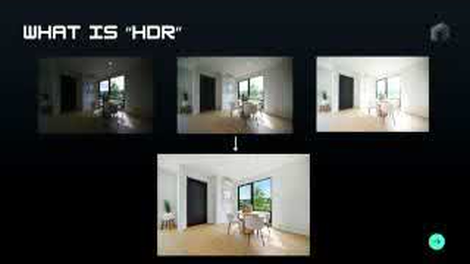
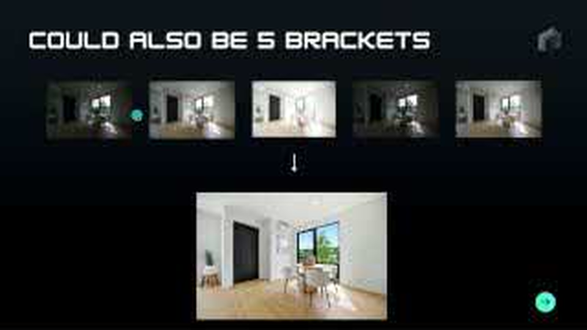
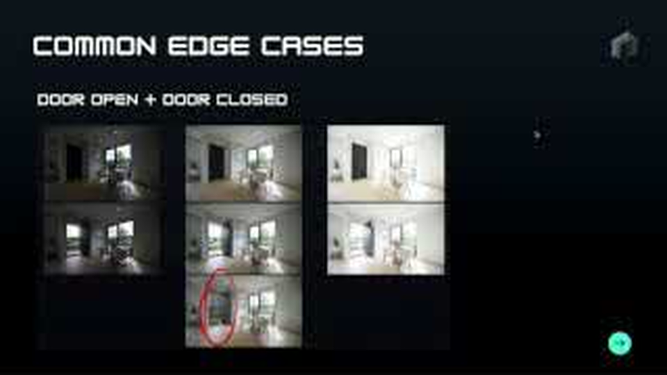
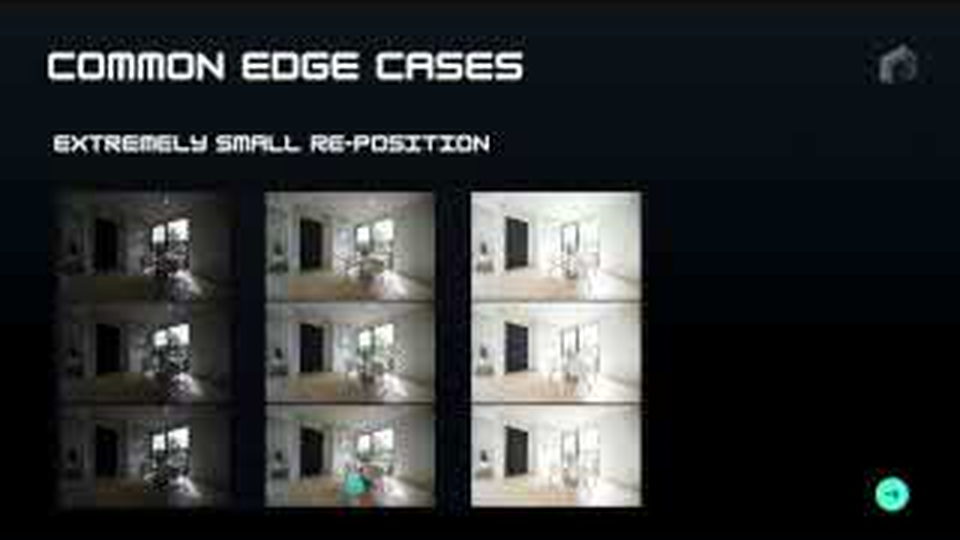
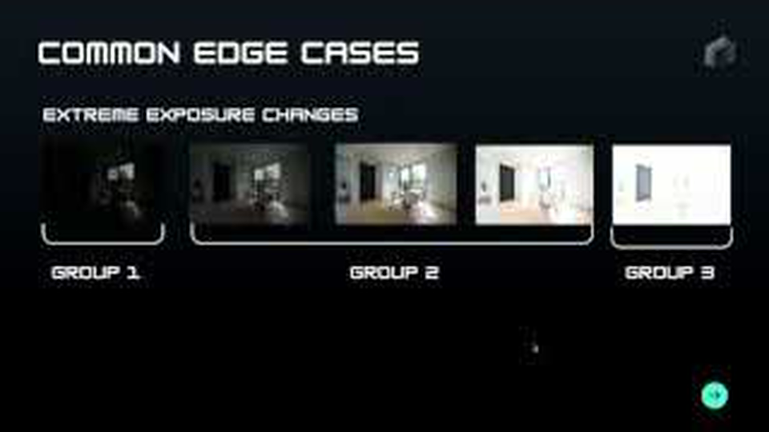

# Image Grouper project context

Source video: [AutoHDR - Grouping Challenge Explained](https://www.youtube.com/watch?v=zHP4wDuIYPU), presented by Josh from AutoHDR  
Video length: 7:29  
Transcript source: YouTube captions, lightly cleaned to remove overlapping caption duplicates and add punctuation

## Key summary

Real estate photographers often capture several photos from the same camera position at different exposure levels. A dark exposure preserves bright details such as the view through a window. A medium exposure captures the room at a normal brightness. A bright exposure reveals details in the shadows. HDR software combines these exposures into one finished photograph.

The product should let a photographer upload an entire shoot without organizing it first. Before AutoHDR can edit the photos, a grouping algorithm must partition the upload into sets of images taken from the same angle. Each set becomes one HDR editing job.

The hard part is that grouping cannot rely on a fixed number of images, filename order, or brightness similarity:

- One angle may contain one, three, five, seven, or some other number of exposures.
- A single shoot may mix different group sizes.
- Files may arrive out of order because of naming or upload behavior.
- Correctly grouped photos may look radically different because their exposures range from nearly black to heavily overexposed.
- Nearly identical photos may belong to different groups. Opening a door or moving the tripod a few centimeters changes the intended final photograph.

The central distinction is therefore not "which photos look most alike?" It is "which photos represent the same intended composition and are safe to merge?" A useful system needs exposure invariance, meaning brightness changes should not hide matching geometry. It also needs strong sensitivity to structural or viewpoint changes, even when most pixels remain similar.

AutoHDR has a human-labeled collection of real photo shoots. A submitted algorithm is scored by comparing its predicted groups with the labeled groups. The video also calls out client-side or upload-time grouping as a bonus because it could reduce backend processing and send complete groups to the editing model sooner.

## What future agents should keep in mind

This is a clustering problem with an unknown number of clusters and unknown cluster sizes. More precisely, it is a constrained partitioning problem. Every uploaded photo must be assigned to the correct same-angle group, including singleton groups that contain only one photo.

Simple adjacent-image rules will be brittle because upload order is not trustworthy. Raw pixel distance will also be brittle because exposure changes can dominate that distance. A serious baseline should compare exposure-resistant visual structure and camera viewpoint, then decide group boundaries using the entire shoot rather than only one neighboring pair at a time.

False merges are especially damaging. If two different compositions enter one HDR edit, the output can contain ghosted furniture, doubled edges, or a blended open and closed door. False splits also matter because an incomplete exposure set can lose window, room, or shadow information. Evaluation should report both types of error instead of hiding them behind one average score.

## Visual examples

### Normal HDR brackets and merged result

Three images share the same composition but have very different brightness. They belong to one group.

### A five-image bracket

Group size is variable. The algorithm cannot assume every group contains three files.

### Door open versus door closed

The tripod does not move, but the photographer intentionally changes the room. These should be separate groups. Merging them creates a bad composite around the door.

### Tiny camera reposition

A small shift in tripod position creates a different composition. Incorrectly merging the two sets can double object edges and create ghosting.

### Extreme exposure differences

These photos belong together even though the darkest and brightest images look very different. A brightness-sensitive algorithm may incorrectly split one group into several.

The screenshots come from YouTube's public storyboard frames because YouTube rejected direct download of the video stream. They preserve the examples and slide context, but their source resolution is limited.

## Full transcript

### 00:03 to 00:54: What HDR is

What even is HDR? We're AutoHDR, so we do it automatically, but specifically what HDR photography is, is high dynamic range. That's when you take a dark photo, a middle-brightness photo, and a super-bright photo.

Here you can see we get the full dynamic range of the room. The dark one lets us see out of the window. The middle one allows us to see basic things like the furniture. Then the super-bright one illuminates the shadows and the other dark aspects of the room.

Traditionally, an editor would blend all three of these together. They'd mask the window from the dark exposure, take the bright parts of the bright one, mask in the shadows, and combine it into this one nice merged photo. At AutoHDR, we do that automatically with our AI models.

The important thing here is that we have these three different brackets going in to create that one nice edited final output image.

### 00:54 to 01:47: The AutoHDR pipeline

Specifically, our pipeline looks like this. A user will go on site and shoot a bunch of these bracketed photos. There is a dark, middle, and bright one for every single angle. You can see that for this living room there would be three. For the kitchen, there would be three. For the house exterior, there would be three.

They just dump all of the images into our site at once. Ease of use is really important to us. Our users need to have a magical experience, right? We don't want them telling us how many brackets they shot or which ones are associated with each other. They should just be able to dump everything in.

What we need to do, and what we do, is automatically group these brackets together. Group one, group two, group three. Once we have our groups of HDR brackets, each group can be run through one of our models and edited into a nice, professional real estate photo.

### 01:47 to 03:41: The grouping challenge

Specifically, this is the challenge: bracket grouping. You need to make an algorithm that can look at a raw photo shoot, just a bunch of photo uploads, and find the groups.

Let me add a little bit of context. It's not always sets of three. Somebody could shoot an entire photo shoot where they're shooting three brackets, but they might also shoot five brackets. It could look something like this.

They're also not always going to be in order. They could shoot dark to bright, then an even darker one, then a bright one. It could even be just one bracket. Some people just shoot one photo for their interiors. They don't do any brackets at all. Or they could shoot seven. It could be any number.

It could even be a mix. They might shoot a single bracket for some of their daytime drone shots because they don't need that much dynamic range. Then they could come back to the photo shoot at sunset and shoot a three-bracket HDR set for one of their drone shots. They might shoot several brackets for an interior, then just a single bracket for some detail shots.

We can't assume that it will be the same number of brackets for any given photo shoot. A user is very likely to upload any mixed number. It could be one bracket, three, five, or seven, and there could be a bunch of mixtures throughout the shoot.

The other thing is that you could get a whole photo shoot where all the photos are uploaded out of order because of some weird naming conventions.

The goal of this algorithm is to take in a photo shoot and output which photos are of the same angle, and which brackets belong to the same group. That's why we call it the grouping algorithm. These would be the same group. These would be the same group. These single ones would all be separate groups.

### 03:41 to 04:35: Edge case one, an open or closed door

Let me walk you through some edge cases. There's a bit of domain knowledge needed here. I'm a real estate photographer myself. I started a real estate photography business before starting AutoHDR, and I've shot thousands of houses. I know this, but you as a programmer or machine learning engineer might not be aware of these things.

Let's look at this example. The photographer shot this room, left the tripod in the same exact location, then shot the room again with the door open. They wanted one option to send to the real estate agent with the door closed and one with the door open.

You can see our grouping algorithm failed. It grouped these angles together because they look so similar, except for the door being open and closed. Then you get this issue where we edited it and had two photos merged together. These should be separate groups.

### 04:35 to 05:01: Edge case two, a tiny reposition

Another edge case is when the photographer shoots the shot, then moves slightly backward or slightly to the side and recomposes it a little. You might get something like this.

These two shots are almost impossible to tell apart with the human eye here, but you can tell they were slightly different because, when they were grouped together, you can see the doubled chair leg. There's some ghosting. So, a slight reposition.

### 05:01 to 05:40: Edge case three, extreme exposure changes

Sometimes it could fail if your exposures are really, really dark, your following exposures look pretty similar to each other, and your next one is extremely bright. This is another common failure case or edge case.

The dark bracket might be grouped by itself because it looks so visually different from the next one. It becomes a group of one, and when it gets edited it looks horrible because it only has the information outside the window. Then the middle exposures become the next group. The last image is so bright that it doesn't get grouped there either.

You end up with three groups where it should all be one. That's another edge case.

### 05:40 to 06:30: Upload flow and browser-side grouping

Our users take all their files and upload them to our website. They drag and drop them into a nice upload process in their browser. It could be from their computer or their phone, whatever. Then it goes into our grouping algorithm before we can edit anything.

One other consideration, if you want bonus points and to really show off, is whether you can do this somehow in the browser or during upload. That would be a massive improvement. We wouldn't need to process or do the grouping on our backend. We could immediately send all of those bracketed groups to our model. That is faster for the user, cheaper for us, and speeds up the time it takes them to get their photos back dramatically.

Keep that in account. If you can do that, it gets you bonus points.

### 06:30 to 07:28: Evaluation and competition

How you win is very simple. You write an algorithm that groups accurately against our labeled set of raw images and their correct groups.

We've had a human data-labeling team go across many of our photo shoots where customers agreed that we could use the images for data labeling, machine learning, and algorithmic testing. We labeled all of them into their correct groups.

You'll be able to submit your algorithm and literally get back a scorecard of how well you did. Go to the Kaggle. It's going to be super objective. The leaderboard will measure exactly how well everyone's algorithm did on the labeled set.

Again, we're looking to hire people from this, and there's going to be a massive $25,000 cash prize for the best engineer to submit here. Go ahead and show us what you've got.
